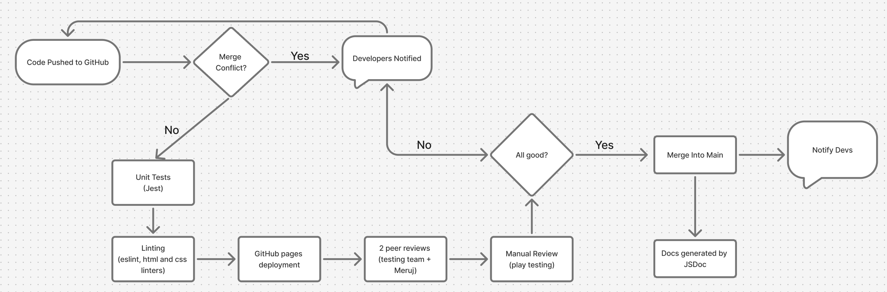

````markdown
# Continuous Integration Pipeline

This file describes our full CI/CD strategy—including the tools we chose, how they fit together, and exactly where each step lives in GitHub Actions.

---

## Overview & Key Stages

1. **Code Push** – Developers push commits to a feature branch.  
2. **Pull Request** – A PR proposes merging into `main`.  
3. **Automated Checks (GitHub Actions)**  
   * **Unit Tests** (Jest)  
   * **Linting** (ESLint, HTMLHint, Style‑lint)  
   * **Documentation Build** (JSDoc)  
   * **Build / Bundle** (when applicable)  
4. **Manual Review** – Code review and quick play‑test.  
5. **Merge to `main`** – Only after all green checks.  
6. **Deployment** – Static site and docs published with GitHub Pages.  
7. **Continuous Documentation** – Fresh JSDoc is attached to the workflow run or published to `docs/`.

---

## Status so far in phase 1
Most of the CI/CD tools are configured and operational:
*   **Unit Tests (Jest):** Configured, and tests are running. The GitHub Actions workflow executes `npm test`.
*   **Linting (ESLint, HTMLHint):** Configured, and `npm run lint` (or individual lint commands) can be run. ESLint and HTMLHint are set up. Stylelint is planned.
*   **JSDoc:** The `jsdoc` package is installed, and an `npm run doc` script exists. However, further setup is needed. This includes:
    *   Verifying or creating the `jsdoc.json` configuration file.
    *   Ensuring the `npm run doc` command correctly generates documentation from the `sources/scripts/` directory into the `docs` folder.
    *   Integrating JSDoc generation and artifact upload/deployment into the GitHub Actions workflow.

## Unit Tests

We use **Jest** because:

* It’s the framework taught in class (low learning curve).
* Fast, zero‑configuration for vanilla projects.
* Easily hooks into GitHub Actions.

<details>
<summary>Typical output</summary>

```text
PASS  tests/app.test.js
✓ Grid System should create an nxn grid correctly (2 ms)
✓ Grid System should validate card placement on grid
…
Test Suites: 1 passed, 1 total
Tests:       N passed, N total
Time:        X.XXX s
```

</details>

---

## Documentation

We generate API docs with **JSDoc**.

* Widely adopted across JS projects.
* Single command: `jsdoc -c jsdoc.json src -d docs`.
* Output automatically uploaded as a workflow artifact and/or deployed to GitHub Pages.

---

## Linting

| Layer          | Tool                        | Why                                                                                                                                                                             |
| -------------- | --------------------------- | ------------------------------------------------------------------------------------------------------------------------------------------------------------------------------- |
| **HTML**       | **HTMLHint**                | Popular, quick setup.                                                                                                                                                           |
| **CSS**        | **Stylelint** (coming soon) | Robust modern CSS linter.                                                                                                                                                       |
| **JavaScript** | **ESLint**                  | Industry standard; strong plugin ecosystem.<br/>Dependencies we use: `@typescript-eslint/parser`, `@typescript-eslint/eslint-plugin`, plus the default naming‑convention rules. |

---

## GitHub Pages Deployment

We deploy two things:

1. **`public/` site** – live playable game.
2. **JSDoc** – API reference (either in `docs/` branch or `/docs` folder).

> GitHub Pages is free for public repos; private repos require a paid plan.

---

## Command‑Line Snapshot

```bash
$ npm test
$ npm run doc
$ npm run lint:js
```



### Summary of Tools

* **Version Control:** Git + GitHub
* **CI/CD:** GitHub Actions
* **Testing:** Jest
* **Linting:** ESLint · HTMLHint · Style‑lint (planned)
* **Documentation:** JSDoc
* **Deployment:** GitHub Pages

